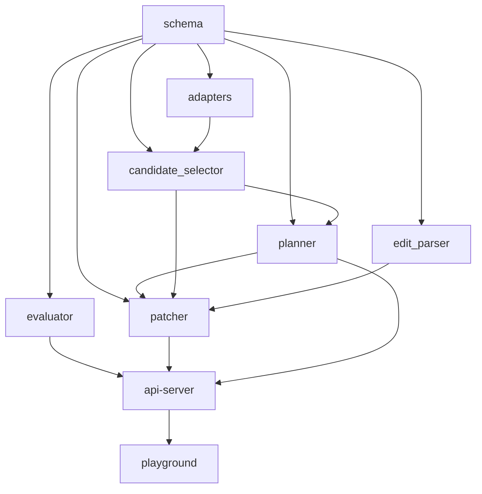

# Architecture

## Monorepo Layout

```text
itinerary-engine/
  apps/
    api-server/
    playground/
  docs/
  examples/
  packages/
    adapters/
    candidate_selector/
    edit_parser/
    evaluator/
    patcher/
    planner/
    schema/
```

## Directory Responsibilities

| Path | Responsibility |
| --- | --- |
| `packages/schema` | Canonical data contracts for requests, itinerary objects, edits, and API payloads |
| `packages/planner` | Baseline itinerary planning logic over selected candidates |
| `packages/candidate_selector` | Candidate retrieval and lightweight ranking before planning |
| `packages/edit_parser` | Parse natural-language change requests into typed edit intents |
| `packages/patcher` | Apply edits and partial replan without regenerating the full trip |
| `packages/evaluator` | Score itinerary quality and compatibility with request constraints |
| `packages/adapters` | Provider interfaces and sample implementations for catalog/ranking inputs |
| `apps/api-server` | FastAPI reference server exposing the runtime through HTTP |
| `apps/playground` | Next.js reference playground for local demos and integration testing |
| `docs` | Public architecture, roadmap, data contracts, API design, and strategy docs |
| `examples` | Copy-ready request payloads and usage snippets |

## v0.1 Required Modules

| Module | Responsibility | Input | Output | Dependencies | Must be open-source |
| --- | --- | --- | --- | --- | --- |
| `TripRequest schema` | Define stable trip request contract | JSON / Python object | Validated request model | none | yes |
| `Itinerary schema` | Define editable itinerary contract | planner / patcher output | stable itinerary object | none | yes |
| `Candidate selector` | Filter and rank POIs for planning | `TripRequest`, destination catalog | candidate POIs | schema, adapters | yes |
| `Baseline planner` | Build day-by-day itinerary | `TripRequest`, candidate POIs | `Itinerary` | schema, candidate selector | yes |
| `Edit intent parser` | Map NL instructions to typed edit actions | instruction text, itinerary context | `EditIntent` | schema | yes |
| `Patcher / partial replan` | Apply local changes and repair impacted days | `Itinerary`, `EditIntent`, `TripRequest` | updated `Itinerary` | schema, planner, selector | yes |
| `API server` | External interface for apps and services | HTTP requests | JSON responses | all core packages | yes |
| `Playground demo` | Validate developer workflow end to end | browser input | visible plan / edit / score flow | API server | yes |

## Dependency Graph



## Why This Stack

### Why Python + FastAPI

- Python is still the lowest-friction language for LLM-adjacent data workflows
- FastAPI gives schema-first HTTP APIs with minimal ceremony
- Pydantic models become the shared contract across planning, patching, and serving
- It is easy to prototype baseline logic first and swap in stronger components later

### Why Next.js for Playground

- Strong developer familiarity and fast iteration speed
- Easy local demo surface for internal and external contributors
- Good fit for dashboard-like forms, JSON panels, and future embedded examples
- Better default choice than a polished product app because the goal is reference integration

### Why schema should be fixed early

- Every module depends on stable itinerary shape
- Schema churn creates breaking changes across API, UI, adapters, examples, and benchmarks
- Without stable identifiers and day-level structure, patching becomes fragile

### Why adapter interfaces should come before concrete providers

- Prevent vendor lock-in from entering the core architecture
- Make local mocks and offline tests possible
- Keep the engine composable for future map, POI, and LLM backends
- Force explicit data boundaries before provider-specific hacks appear
